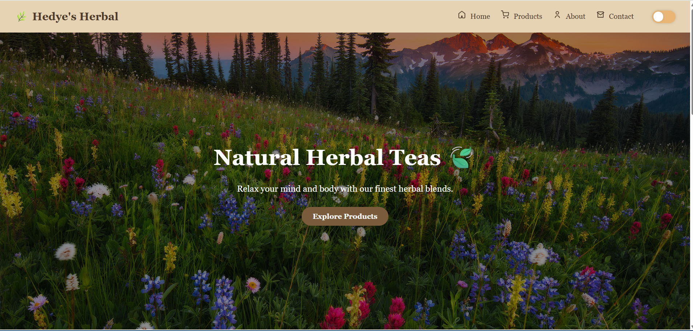

# 🍵 Herbal Tea Store

A beautifully designed front-end web project for a fictional herbal tea store. Built with pure HTML and CSS, this responsive website showcases various tea products and offers a smooth user experience.

## 📸 Preview



## 💡 Features

- Elegant and clean design
- Responsive layout
- Dark mode toggle
- Animated hover effects
- Interactive product cards
- Newsletter subscription form
- Footer with social media links

## 📁 Technologies Used

- HTML5
- CSS3 (Flexbox, transitions, custom styles)

## 📌 Notes

This is a front-end only project made for learning and practice purposes.

## 🚀 Getting Started

To view the project locally:

```bash
# Clone the repository
git clone https://github.com/hedy-codes/product-landing-page.git

# Open index.html in your browser
```

---

Created with ❤️ by Hedye Azizi
